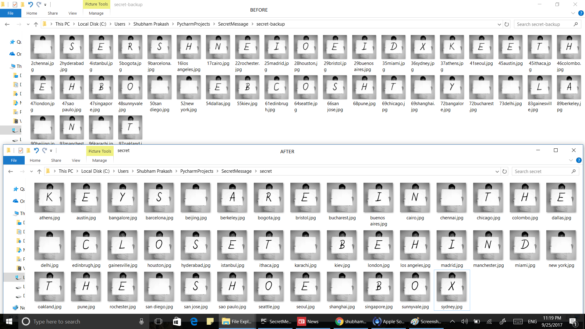

# Secret Message and Decoder

This is Secret message maker along with the  message decoder. 
The message is encrypted in the form ALPHABETS in Jumbled pictures
to decode it ren the decoder.py file 


## INSTALL

Requires Python 3.6
```
    Install python 3.6
```
Download the Repository in local computer
```
    navigate to downloaded directory
```

open the `decoder.py` file in **python IDLE** 
```
    press F5
```

## PROCEDURE

1. The Message is hidden in jumbled unorganised pictures.
2. Run the `decoder.py` as explained above.
3. The Pictures inside Secret folder gets organised and the message gets decoded.